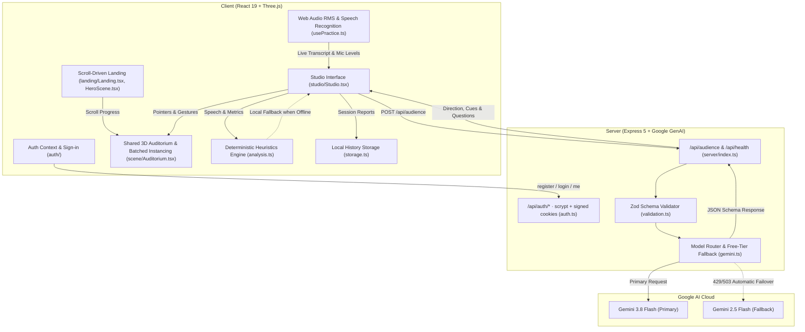

<div align="center">

# 🎙️ Podium Studio

**Step onto the stage. Connect with your audience. Master the room.**

An immersive 3D rehearsal studio and AI-assisted public speaking coach that puts you directly behind the speaker's lectern.

[](https://react.dev/)
[](https://www.typescriptlang.org/)
[](https://threejs.org/)
[](https://ai.google.dev/)
[](https://vitejs.dev/)
[](LICENSE)

[Features](#-key-features) • [Architecture](#-architecture) • [Getting Started](#-quick-start) • [Gemini Setup](#-gemini-ai-configuration) • [Audience Engine](#-audience-dynamics--simulation) • [Privacy](#-privacy--ethics)

</div>

---

## 🌟 Overview

Public speaking is one of the most widespread fears in the world, yet effective practice usually happens in front of a mirror or an empty wall. **Podium** transforms your preparation into an active, immersive experience:

- Look out from behind a real oak lectern and gooseneck microphone into a raked auditorium filled with dozens of individually animated listeners.
- Deliver your talk using **real-time voice transcription** or **typed script rehearsal**.
- Gauge room energy with live simulated engagement, speaking pace (words per minute), and filler phrase detection.
- Receive spontaneous questions from the audience powered by **Google Gemini 3.8 Flash** or local heuristic simulation.
- Review your post-talk reflection report with actionable feedback, exportable session history, and zero audio storage.

```
       __________________________________________________________________
      |                                                                  |
      |   [ Audience: 48 ]    [ Energy: Supportive ]    [ Pace: 135 WPM ] |
      |__________________________________________________________________|
      |                                                                  |
      |               ╭────────────────────────────────╮                 |
      |               │     THE GRAND AUDITORIUM       │                 |
      |               │                                │                 |
      |               │    [Audience: Engaged 82%]     │                 |
      |               │     O   O   O   O   O   O      │                 |
      |               │    /|\ /|\ /|\ /|\ /|\ /|\     │                 |
      |               │     |   |   |   |   |   |      │                 |
      |               │                                │                 |
      |               │   [== Lectern & Microphone ==] │                 |
      |               ╰────────────────────────────────╯                 |
      |                                                                  |
      |   ● REC 02:45 / 05:00     [|| Waveform: ▂▃▅▇ ]    [ End Session ] |
      |__________________________________________________________________|
```

---

## ✨ Key Features

### 🎬 Cinematic Landing & Accounts
- **Scroll-Driven Flythrough:** The landing page (`/`) walks you from the dark back of the hall, down the aisle as the seats fill row by row, and around to the speaker's view behind the lectern — all driven by scroll with Lenis inertial smoothing and GSAP ScrollTrigger.
- **Editorial Motion:** Word-by-word manifesto reveal, a velocity-reactive marquee, a pinned horizontal feature track, stacking audience cards and counting statistics. Every effect respects `prefers-reduced-motion`.
- **Accounts:** Sign in or create an account at `/signin` (scrypt-hashed passwords, signed HttpOnly session cookies), or continue as a guest. Session history is kept per account.
- **"Limelight" Design System:** A dark theatre where the rendered room carries the colour, glass chrome stays quiet and a single limelight accent marks the next action. Self-hosted Inter Tight, Instrument Serif and JetBrains Mono — no external font requests.

### 🏛️ Procedural 3D Auditorium
- **Authentic Speaker Vantage:** View the room from the actual height and perspective of the podium, looking out over raked seating, exit doors, acoustic panels, and warm stage lights.
- **Batched GPU Rendering:** Built with Three.js and `@react-three/drei` instanced geometry. High performance and smooth 60 FPS even on integrated graphics.
- **Zero Asset Downloads:** All architectural geometry, lighting, textures, and characters are procedurally generated in-engine—no multi-megabyte GLTF models or external downloads required.
- **Reduced Motion Support:** Respects `prefers-reduced-motion` to disable animations and camera parallax for accessible practice.

### 👥 Dynamic Simulated Audience
- **Configurable Crowds:** Rehearse in front of intimate workshops (24 people), full auditoriums (48 people), or packed lecture halls (72 people).
- **Temperament Control:** Choose the room's energy:
  - ☺ **Supportive:** Encouraging, receptive listeners who respond warmly to your opening.
  - ◉ **Neutral:** Attentive, professional room waiting to be convinced by concrete examples.
  - ↗ **Challenging:** Thoughtful, skeptical crowd with tough follow-ups and strict engagement standards.
- **Interactive Gestures:** Audience heads subtly nod with high engagement, glance away when distracted, or raise a hand when asking a question.

### 🎙️ Dual Rehearsal Modes
1. **Live Microphone Mode:**
   - Web Audio API analyzes vocal level and live RMS volume metrics.
   - Built-in browser speech recognition streams real-time transcript excerpts.
   - Automatic silence recovery and typed fallback if microphone hardware is unavailable.
2. **Silent Typed Rehearsal:**
   - Perfect for quiet offices, commutes, or drafting your presentation outline.
   - Type speech fragments and add them directly into the rehearsal stream.
   - Speaking pace is intentionally withheld to prevent misleading vocal metrics on typed input.

### 🤖 Intelligent Gemini Director
- **Context-Aware Coaching:** Excerpts from your transcript are processed by **Gemini 3.8 Flash** (Google's latest low-latency multimodal model).
- **Free-Tier Dual Fallback:** Automatically cascades from Gemini 3.8 Flash to Gemini 2.5 Flash if rate-limited or busy, and gracefully falls back to deterministic local heuristics.
- **Audience Questions:** The audience can interrupt or conclude with genuine questions synthesized directly from your speech topics, complete with browser speech synthesis read-aloud.
- **Safe Prompt Boundaries:** User transcripts are strictly treated as untrusted speech data—never executed as system instructions.

### 📊 Comprehensive Session Reflection
- **Granular Metrics:** Measured speaking pace (WPM), filler phrase counter (`um`, `uh`, `you know`, `sort of`, `kind of`), and active duration.
- **Structured Takeaways:** Concrete strengths, one targeted improvement for your next run, and a provocative question to test your depth of knowledge.
- **Local Persistence:** Your last 20 session reports persist in browser `localStorage`, namespaced per account.
- **JSON Export:** Download your transcripts and performance reflections anytime.

---

## 🏗️ Architecture



---

## 🚀 Quick Start

### Prerequisites
- **Node.js**: Version 20.0.0 or higher
- **npm**: Version 10.0.0 or higher

### Installation

1. **Clone the repository:**
   ```bash
   git clone https://github.com/satiricalguru/Podium.git
   cd Podium
   ```

2. **Install dependencies:**
   ```bash
   npm install
   ```

3. **Start the local studio:**
   ```bash
   npm run dev
   ```

4. **Take the stage:**
   Open **http://127.0.0.1:5173** in your browser. The studio will boot immediately in offline-capable local mode!

---

## 🔑 Gemini AI Configuration

Podium runs **100% locally** out of the box with zero external accounts or API keys required. 

To enable generative audience reactions and contextual follow-up questions powered by Google Gemini:

1. Copy the environment template:
   ```bash
   cp .env.example .env
   ```

2. Obtain a free API key from [Google AI Studio](https://aistudio.google.com/).

3. Add your key to `.env`:
   ```dotenv
   # Server-side only. Never prefix with VITE_
   GEMINI_API_KEY=your_google_ai_studio_key_here
   GEMINI_MODEL=gemini-3.8-flash
   PORT=3001
   ```

4. Restart the development server:
   ```bash
   npm run dev
   ```

5. Toggle the **Gemini audience** switch in the *Set the scene* panel inside the app!

---

## 🎭 Audience Dynamics & Simulation

Podium models audience engagement using deterministic behavioral heuristics calibrated against public speaking research:

| Metric | Supportive Baseline | Neutral Baseline | Challenging Baseline |
| :--- | :---: | :---: | :---: |
| **Initial Energy** | `78%` | `65%` | `52%` |
| **Pace Sweet Spot** | 105 – 175 WPM | 115 – 165 WPM | 120 – 160 WPM |
| **Pace Penalty** | `< 105` or `> 175` WPM (`-8%`) | `< 105` or `> 175` WPM (`-8%`) | `< 105` or `> 175` WPM (`-8%`) |
| **Filler Penalty** | Scaled to % of word count | Scaled to % of word count | Scaled to % of word count |
| **Reaction Thresholds** | >72% Engaged, >54% Curious | >72% Engaged, >54% Curious | >72% Engaged, >54% Curious |

*When Gemini is active, qualitative transcript coherence and thematic progress modulate these scores in real time.*

---

## 🛠️ Tech Stack

| Layer | Technologies |
| :--- | :--- |
| **Frontend Framework** | React 19, TypeScript 5.7 |
| **3D Engine** | Three.js (r180), `@react-three/fiber`, `@react-three/drei` |
| **Styling & Design** | Vanilla CSS design tokens, self-hosted Fontsource fonts (`Inter Tight`, `Instrument Serif`, `JetBrains Mono`) |
| **Motion** | GSAP 3 + ScrollTrigger, Lenis smooth scrolling |
| **Icons** | Lucide React |
| **Backend & API** | Node.js, Express 5.1, `dotenv` |
| **AI & Validation** | `@google/genai` (SDK 1.0+), Zod 3.24 (Type-safe schema boundaries) |
| **Build & Tooling** | Vite 6.1, `tsx`, Node native test runner (`node:test`) |

---

## 🧪 Testing & Verification

Podium features comprehensive unit and integration test suites:

```bash
# Run unit and schema verification tests
npm test

# Run TypeScript typechecks and production Vite compilation
npm run build

# Start production server serving both API and static frontend
npm start
```

### Verified Test Matrix
- **Unicode Tokenization:** Multilingual character segmentation, emojis, smart apostrophes, and contractions.
- **Disfluency Matching:** Complete filler phrases (`um`, `uh`, `you know`) without false positives on legitimate words (e.g., *aluminum*, *museum*).
- **Pace Bounding:** Strict suppression of artificial speaking rates for typed sessions or insufficient voice durations (<15s).
- **AI Fault Tolerance:** 100% test coverage for automatic failovers from Gemini 3.8 Flash to Gemini 2.5 Flash and offline local fallback.

---

## 🔒 Privacy & Ethics

- **Zero Raw Audio Storage:** Podium never records, persists, or transmits raw audio files.
- **Audio Processing:** Browser speech recognition processes speech via standard Web Speech APIs.
- **Telemetry Boundaries:** Only clean text transcript excerpts and basic timing counts are transmitted to Gemini when explicitly enabled by the user.
- **No Pseudo-Science:** Podium explicitly **does not** infer mental health, gaze tracking, emotion recognition, racial accent grading, or biometric anxiety. All engagement scores are transparently labeled as simulations.
- **Local Sovereignty:** Session history is saved exclusively in the user's browser `localStorage` and can be wiped with a single click.
- **Accounts:** Only name, email and an scrypt password hash are stored, in `data/users.json` on your server (git-ignored). Sessions are stateless HMAC-signed cookies; set `SESSION_SECRET` or one is generated into `data/.session-secret`.

---

## 📂 Project Structure

```text
Podium/
├── docs/
│   ├── BUILD_PLAN.md         # Research, acceptance criteria & roadmap
│   └── VERIFICATION.md       # Audit logs, browser tests & benchmarks
├── public/
│   └── favicon.svg           # Podium geometric icon
├── server/
│   ├── gemini.ts             # Google GenAI model router with free-tier fallback
│   ├── gemini.test.ts        # Model failover & quota handling tests
│   ├── auth.ts               # Password hashing, signed session tokens & JSON user store
│   ├── auth.test.ts          # Token tampering, hashing & user store tests
│   ├── index.ts              # Express 5 API with security headers & rate limiting
│   ├── validation.ts         # Zod schemas for inbound/outbound payloads
│   └── validation.test.ts    # Schema boundary & bounds tests
├── src/
│   ├── hooks/
│   │   └── usePractice.ts    # AudioContext RMS meter & SpeechRecognition lifecycle
│   ├── lib/
│   │   ├── analysis.ts       # Text tokenization, filler regex, & local audience
│   │   ├── analysis.test.ts  # Tokenizer & pacing test suites
│   │   ├── storage.ts        # Zod-validated localStorage history adapter
│   │   └── types.ts          # Core domain models & speech interface declarations
│   ├── auth/                 # AuthContext (account + guest) and the sign-in page
│   ├── landing/              # Landing page, scroll-driven HeroScene & motion helpers
│   ├── scene/Auditorium.tsx  # Shared procedural theatre, lighting rig & instancing
│   ├── studio/               # Studio shell, panels, dialogs, history & StageRoom
│   ├── styles/               # base (tokens), landing, auth & studio stylesheets
│   ├── ui/                   # Dialog, IconButton & Wordmark primitives
│   ├── App.tsx               # Routes and auth guards
│   ├── router.tsx            # Tiny History API router
│   └── main.tsx              # React 19 root, fonts & styles
├── index.html                # HTML5 entrypoint with SEO meta tags
├── LICENSE                   # MIT License
├── package.json              # Project dependencies & scripts
├── tsconfig.json             # TypeScript 5.7 strict configuration
└── vite.config.ts            # Vite bundle optimization & Three.js manual chunking
```

---

## 📄 License

Distributed under the **MIT License**. See [`LICENSE`](LICENSE) for complete details.

---

<div align="center">
  <sub>Built with care for every speaker preparing for their big moment.</sub>
</div>
